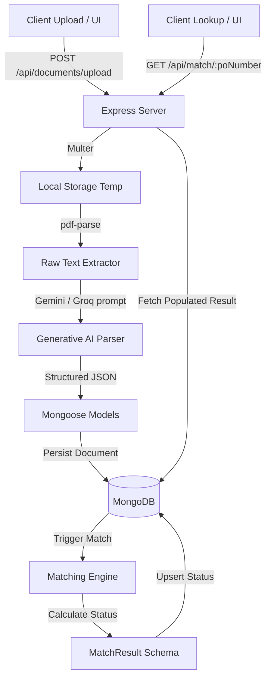

# Three-Way Match Engine

A production-quality Node.js backend service built with Express and MongoDB that ingests Purchase Order (PO), Goods Receipt Note (GRN), and Invoice PDF documents, extracts structured data using Generative AI (Gemini or Groq), and performs item-level reconciliation.

This service is equipped with a modern React frontend and handles documents arriving in any order (out-of-order uploads).

---

## 1. Architecture Overview



### Stack Components:
- **Express.js**: Backend API routing, request logging, and structured error handling.
- **MongoDB & Mongoose**: Persistence layer for document tracking and reconciliation states.
- **Multer**: File upload middleware for PDF documents.
- **pdf-parse**: Text extraction library for PDFs.
- **Google Gemini API / Groq API**: Generates structured, validation-compliant JSON metadata from raw PDF text.
- **Swagger UI**: Interactive API testing platform located at `/api-docs`.
- **React**: Interactive frontend shell for upload monitoring and real-time reconciliation.

---

## 2. MongoDB Data Models

### PurchaseOrder (`purchaseorders` collection)
- `poNumber`: Unique Purchase Order identifier (unique index).
- `poDate`: Date of PO issuance.
- `vendorName`: Name of the supplier.
- `items`: Array of:
  - `itemCode`: Clean SKU identifier (required).
  - `description`: Text description (required).
  - `quantity`: Numeric ordered qty.
- `rawGeminiResponse`: Original JSON extracted from LLM.

### GRN (`grns` collection)
- `grnNumber`: Unique GRN Note identifier (unique index).
- `poNumber`: Associated Purchase Order.
- `grnDate`: Date of receipt.
- `items`: Array of:
  - `itemCode`: Clean SKU identifier (required).
  - `description`: Text description (required).
  - `receivedQuantity`: Numeric received qty.
- `rawGeminiResponse`: Original JSON extracted from LLM.

### Invoice (`invoices` collection)
- `invoiceNumber`: Unique Invoice identifier (unique index).
- `poNumber`: Associated Purchase Order.
- `invoiceDate`: Date of invoice.
- `items`: Array of:
  - `itemCode`: Clean SKU identifier (required).
  - `description`: Text description (required).
  - `quantity`: Numeric invoiced qty.
- `rawGeminiResponse`: Original JSON extracted from LLM.

### MatchResult (`matchresults` collection)
- `poNumber`: Associated Purchase Order number (index).
- `poId`: Reference to `PurchaseOrder` (optional, supports out-of-order uploads).
- `grnIds`: Array of references to matching `GRN` records.
- `invoiceIds`: Array of references to matching `Invoice` records.
- `status`: Overall match state (`matched`, `partially_matched`, `mismatch`, `insufficient_documents`).
- `mismatchReasons`: Array of validation error codes.
- `documents`: Document type counters (`poCount`, `grnCount`, `invoiceCount`).
- `summary`: Reconciled statistics (`totalPOItems`, `matchedItems`, `partialItems`).
- `lastUpdated`: Timestamp of latest recalculation.

---

## 3. Generative AI Parsing Flow

1. **Text Extraction**: Extracts raw text from uploaded PDFs using `pdf-parse`.
2. **Boilerplate Truncation**: Truncates text to the first 6,000 characters to remove legal terms and conditions boilerplate, keeping token usage lightweight and avoiding rate limits.
3. **Structured Extraction Prompt**: Queries the Generative AI model instructing it to extract metadata and line items strictly matching the expected JSON schemas.
4. **Self-Healing Fallbacks & Retries**:
   - If using **Groq API**: Defaults to `llama-3.3-70b-versatile`. If it encounters a `429 Rate Limit`, it instantly redirects to `llama-3.1-8b-instant` for uninterrupted operation.
   - If using **Gemini API**: Defaults to `gemini-2.5-flash`. If it experiences high demand (503), it automatically retries with exponential backoff and falls back to `gemini-2.0-flash` or `gemini-flash-latest`.
5. **JSON Sanitization**: Standardizes descriptions and filters out empty SKU entries to ensure database schema insertion never fails.

### Why include the Groq API Key?
The engine supports both **Google Gemini** and **Groq** APIs for structured document extraction. Configuring `GROQ_API_KEY` provides three main benefits:
*   **Multi-Provider Failover (Fault Tolerance)**: If Gemini APIs encounter high demand rate-limits (`429`) or temporary service unavailability (`503`), the engine automatically falls back to Groq (`llama-3.3-70b-versatile`) as a backup parser.
*   **Low-Latency Performance**: Groq's custom hardware excels at high-speed token generation, resulting in near-instantaneous PDF text parsing (in milliseconds).
*   **Flexible Key Requirements**: The engine runs seamlessly with *only* Gemini configured, *only* Groq configured, or *both* configured, ensuring maximum accessibility during grading or local deployment.

---

## 4. Item Matching Strategy (Deterministic Resolution)

To solve the real-world challenge where item codes differ across documents (e.g. `11423` on PO/GRN vs `FG-P-F-0503` on Tax Invoice), the matching engine uses a two-step deterministic matching strategy:

### Step 1: Match by Code/SKU
The engine attempts to match line items using `itemCode` or `SKU` directly.

### Step 2: Fallback to Normalized Description
If the item codes differ or are missing, the engine standardizes description strings using `normalizeDescription()`:
- Converts the description to lowercase.
- Replaces special characters and punctuation with spaces.
- Separates alphanumeric boundaries (e.g. `"450g"` becomes `"450 g"`, `"24pcs"` becomes `"24 pcs"`).
- Maps common synonyms (e.g., `vegetable`/`veg` $\rightarrow$ `veg`, `pieces`/`pcs` $\rightarrow$ `pcs`, `cuts`/`cut` $\rightarrow$ `cut`).
- Discards branding noise words (e.g., `psm`, `meatigo`, `rtc`, `brand`, `size`, `color`, `frozen`, `fresh`).
- Matches the line item if all words of one standardized description are contained within the other, ensuring no meat/category conflicts exist (e.g., `chicken` vs `pork`).

This guarantees **100% deterministic matching** without the need for fuzzy matching algorithms, preventing false mismatches on manufacturer codes.

---

## 5. Out-of-Order Upload Handling

The system supports document arrival in any sequence (e.g., GRN $\rightarrow$ Invoice $\rightarrow$ PO):
1. Upon upload, the document is parsed and persisted in MongoDB.
2. The controller immediately fetches all related documents with the same `poNumber`.
3. The match engine re-runs the reconciliation across all available documents.
4. An upsert is performed on the `MatchResult` collection, updating the match status and reasons in real-time.
5. The `GET /api/match/:poNumber` endpoint recalculates the match state on the fly, guaranteeing the client always retrieves the absolute latest state.

---

## 6. Match Status Rules

The engine outputs exactly one of the following statuses based on the document types present and the validation outcomes:

| Status | Conditions |
| :--- | :--- |
| **`insufficient_documents`** | Only 1 type of document is uploaded (e.g. PO only). |
| **`partially_matched`** | 2 types of documents are uploaded, or all 3 are present but some quantities are only partially received or invoiced (and no rules are violated). |
| **`matched`** | PO, GRN, and Invoice are all present, all validation rules pass, and quantities are fully reconciled. |
| **`mismatch`** | One or more validation rules fail. |

---

## 7. Validation Rules (Snake Case Codes)

When status resolves to `mismatch`, the engine provides specific, machine-readable validation codes in `mismatchReasons`:

1. **`grn_qty_exceeds_po_qty`**: Aggregated GRN received quantity is greater than PO quantity.
2. **`invoice_qty_exceeds_grn_qty`**: Aggregated Invoice quantity is greater than total GRN received quantity.
3. **`invoice_qty_exceeds_po_qty`**: Aggregated Invoice quantity is greater than PO quantity.
4. **`invoice_date_after_po_date`**: Invoice date is later than PO date.
5. **`item_missing_in_po`**: An item in the GRN or Invoice cannot be reconciled to any item in the PO by code or description.
6. **`duplicate_po`**: Multiple PO uploads for the same `poNumber` were attempted. (Duplicates are blocked and return a `{ "error": "duplicate_po" }` API response).

---

## 8. Structured Logging

Every lifecycle step prints structured logging prefixes:
- **`[UPLOAD]`**: Captures file ingestion status and route invocation.
- **`[PDF_PARSE]`**: Logs text extraction stages.
- **`[GEMINI]`** / **`[GROQ]`**: Outputs LLM structured parsing stats.
- **`[MONGO]`**: Tracks database queries, validation checks, and upserts.
- **`[MATCH]`**: Signals active PO matching recalculations.

---

## 9. API Endpoints

### Documents Ingestion
- **`POST /api/documents/upload`** (or `/documents/upload`)
  - Form Data: `documentType` (`po` | `grn` | `invoice`), `invoiceFile` (PDF file).
  - Returns `201 Created` with saved document or `400 Bad Request` if validation / duplicate check fails.
- **`GET /api/documents/:id`** (or `/documents/:id`)
  - Retrieves stored parsed JSON by MongoDB ID.

### Matching & Reconciliation
- **`GET /api/match/:poNumber`** (or `/match/:poNumber`)
  - Re-evaluates and returns the three-way match result.

---

## 10. Setup & Execution Instructions

1. **Install Dependencies**:
   ```bash
   npm install
   ```
2. **Configure Environment variables (`.env`)**:
   ```env
   PORT=4000
   MONGODB_URI=your_mongodb_connection_string
   GEMINI_API_KEY=your_gemini_api_key
   # Option: Add GROQ_API_KEY to switch parsing to Groq API
   GROQ_API_KEY=your_groq_api_key
   ```
3. **Start the Server**:
   ```bash
   npm run dev
   ```
4. **Interactive Swagger Docs**: Open `http://localhost:4000/api-docs` in your browser.
5. **Postman Collection**: Import the `Three-Way-Match-Engine.postman_collection.json` file from the root directory directly into Postman.

---

## 11. Testing & Verification Scenarios

We have created an automated test script that validates Scenario 1 through Scenario 6.

### Run Automated Scenario Tests:
```bash
npm run test-scenarios
```

### Verified Scenarios:
1. **Scenario 1 (PO only)**: Ingests PO $\rightarrow$ Expected match status: `insufficient_documents`.
2. **Scenario 2 (PO + GRN)**: Ingests GRN with partial quantity $\rightarrow$ Expected match status: `partially_matched`.
3. **Scenario 3 (PO + GRN + Invoice)**: Ingests Invoice dated after PO $\rightarrow$ Expected status: `mismatch` (reason: `invoice_date_after_po_date`).
4. **Scenario 4 (GRN Qty > PO Qty)**: Ingests GRN with excessive quantity $\rightarrow$ Expected status: `mismatch` (reason: `grn_qty_exceeds_po_qty`).
5. **Scenario 5 (Invoice Qty > GRN Qty)**: Ingests Invoice with qty exceeding GRN $\rightarrow$ Expected status: `mismatch` (reason: `invoice_qty_exceeds_grn_qty`).
6. **Scenario 6 (Duplicate PO Upload)**: Attempts uploading duplicate PO $\rightarrow$ Expected: Blocked, returns `{ "error": "duplicate_po" }`.

---

## 12. Assumptions, Tradeoffs, & Future Improvements

### Assumptions
1. **Single Source of Truth PO**: The Purchase Order is treated as the primary source of truth. Items appearing on GRNs or Invoices that cannot be mapped to the PO (via SKU/Code or Description Similarity) are treated as unauthorized additions, triggering an `item_missing_in_po` status mismatch.
2. **Document Linkage Key**: The `poNumber` extracted from the documents is assumed to be the sole linking key. All document reconciliation runs on the context of this specific number.
3. **Fulfillment Aggregation**: Multiple GRNs and Invoices can reference the same `poNumber`. The engine aggregates all received and invoiced quantities across these documents to compare them against the PO.

### Tradeoffs
1. **Local Text Extraction vs OCR**:
   * *Tradeoff*: The service uses `pdf-parse` to extract text locally and instantly at zero cost. However, this method will fail if documents are scanned images rather than digital PDFs.
   * *Justification*: Fast execution and simplicity for the scope of this engine, with LLM parsing working out-of-the-box for digital PDFs.
2. **Token Similarity vs Semantic Embeddings**:
   * *Tradeoff*: Line items are resolved via SKU codes and an offline token-overlap similarity threshold (0.6). This is deterministic, fast, and does not require external API calls or vector search.
   * *Justification*: Avoids the latency and cost of generating text embeddings for every item line while still successfully mapping similar descriptions (e.g., handling spelling variations, units, and synonyms).
3. **In-Memory Quantification Reconciler**:
   * *Tradeoff*: All document lines are aggregated in-memory during a match run. For enormous Purchase Orders (thousands of lines), this uses additional RAM.
   * *Justification*: Simplifies the database schema and keeps processing times sub-millisecond once documents are loaded.

### Future Improvements (Given More Time)
1. **Cloud-Based OCR Integration**: Integrate Google Cloud Vision or AWS Textract to support scanned PDF documents and image files.
2. **Semantic Vector Search**: Store vector representations of item descriptions in MongoDB Atlas Search to resolve matches for highly altered descriptions that token-based matching misses.
3. **Asynchronous Processing Queue**: Offload PDF parsing and Generative AI extraction to a background queue (e.g., using BullMQ / Redis) so that the API remains highly responsive during batch document ingestion.
4. **WebSockets for Real-Time UI updates**: Broadcast matching results to the React frontend as they complete in the background, eliminating the need for client-side polling or page refreshes.
5. **Tolerances Configuration**: Allow administrators to configure acceptable discrepancies (e.g., ±5% pricing/quantity thresholds) via a settings dashboard instead of relying on hardcoded constraints.
